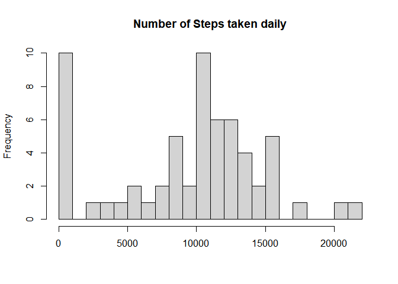
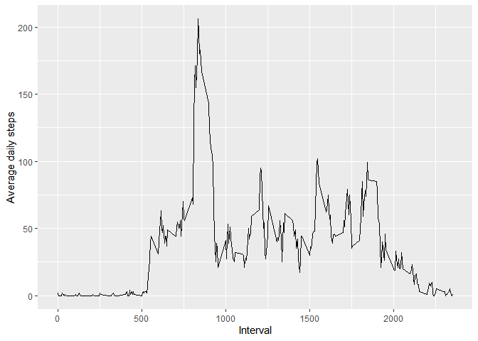
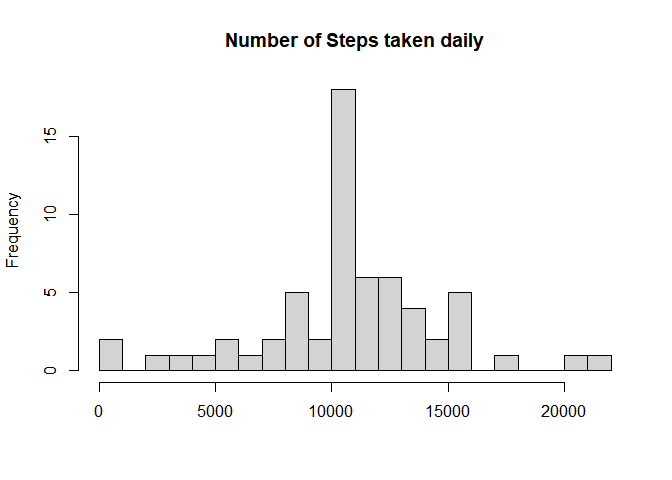
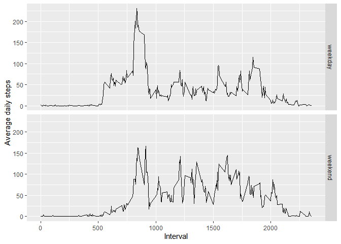

## Loading and preprocessing the data

```r
file <- read.csv("activity.csv")
df <- data.frame(file)
#head(df)
#str(df)
df$date <- as.Date(df$date, "%Y-%m-%d")

# Not every interval is recorded. 
# length(unique(df$interval))=288
# interval:0 -- 2355.
```


## What is mean total number of steps taken per day?


```r
library(dplyr)
```

```
## 
## Attaching package: 'dplyr'
```

```
## The following objects are masked from 'package:stats':
## 
##     filter, lag
```

```
## The following objects are masked from 'package:base':
## 
##     intersect, setdiff, setequal, union
```

```r
dailySteps <- df %>%
        group_by(date) %>%
        summarise(n=sum(steps, na.rm=TRUE))
```

```
## `summarise()` ungrouping output (override with `.groups` argument)
```

```r
hist(dailySteps$n, breaks = 20, main="Number of Steps taken daily", xlab="") 
```

<!-- -->

```r
mean <- round(mean(dailySteps$n, na.rm=TRUE), 0.1)
median <- median(dailySteps$n, na.rm=TRUE)
```

** Summary **  
The mean of the total number of steps taken per day: 9354  
The median of the total number of steps taken per day: 10395


## What is the average daily activity pattern?

```r
library(ggplot2)

pattern <- data.frame(interval=unique(df$interval))

dailyAverage <- with(df, tapply(steps, as.factor(interval), mean, na.rm=TRUE)) # calculate a mean and send to all applicable rows. 

pattern$dailyAverage <- as.integer(round(dailyAverage, 0.1)) # round up to an integer.

# geom_line() requires x values are integers, not factors. 
g <- ggplot(pattern, aes(x=interval, y=dailyAverage)) +
        geom_line() +
        labs (x="Interval", y="Average daily steps")

print(g)
```

<!-- -->

```r
max <- pattern$interval[which.max(pattern$dailyAverage)]
```


**Report**

The interval that contains the maximum number of steps is 835.


## Imputing missing values


```r
## check each row to identify missing steps.
identifyStatus <- function(record){
        if(is.na(record[1])) return("Missing")
        else return("Complete")
}

status <- apply(df, 1, identifyStatus)
numOfMissing <- length(which(status=="Missing"))

## Fill in the missing data(steps) by assigning the average steps in that given interval.

df2 <- df  # copy the original data frame.

for(i in 1:nrow(df2)){
        if(is.na(df2$steps[i])) {
                interval <- df2$interval[i]
                df2$steps[i] <- pattern$dailyAverage[which(pattern$interval==interval)]
        } else {
                next
        }
}

dailySteps2 <- df2 %>%
        group_by(date) %>%
        summarise(n=sum(steps))
```

```
## `summarise()` ungrouping output (override with `.groups` argument)
```

```r
hist(dailySteps2$n, breaks = 20, main="Number of Steps taken daily", xlab="") 
```

<!-- -->

```r
mean2 <- as.integer(mean(dailySteps2$n))
median2 <- median(dailySteps2$n) 
```
** Report **

1. The total number of rows with NA: 2304

2. After filling in the missing data:  
The mean of the total number of steps taken per day: 10765  
The median of the total number of steps taken per day: 10762

3. Both mean and median are greater after imputing missing data than before imputing missing data. 


## Are there differences in activity patterns between weekdays and weekends?


```r
dayFactor <- factor(c("weekday", "weekend"))

setDay <- function(dateObj){
        day <- weekdays(dateObj)
        if(day=="Saturday" | day=="Sunday") return(dayFactor[2])
        else return(dayFactor[1])
}


df2$day <- sapply(df2$date, setDay)

pattern2 <- df2 %>%
  group_by(interval, day) %>%
  summarise(dailyAverage=mean(steps))
```

```
## `summarise()` regrouping output by 'interval' (override with `.groups` argument)
```

```r
q <- ggplot(pattern2, aes(x=as.integer(interval), y=dailyAverage)) +
    facet_grid(day~.) +   
    geom_line() +
    labs (x="Interval", y="Average daily steps")

print(q)
```

<!-- -->

